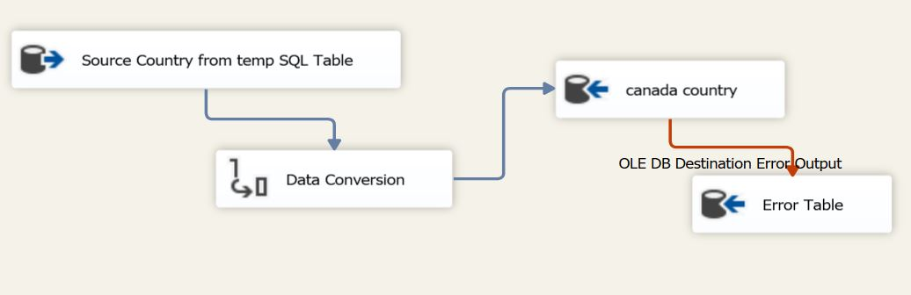
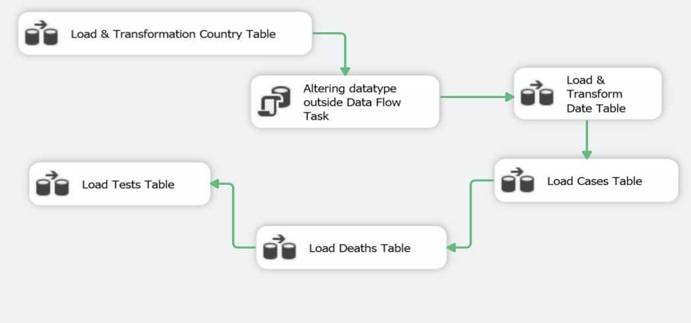

# CovidData

Data can give great insights during these hard times. Thinking of it, I've decided to build some dashboards using all of the information available on the Covid-19 spread.

My source is: https://ourworldindata.org/covid-cases

As you can see, is a table with 32 columns and at least 23k rows (with new ones being daily added). 
I decided to keep the first version of the table and also to break it into five new tables:

[Date]
[Country]
[Cases]
[Deaths]
[Tests]

The reason is only a matter of practicality, as in some cases, I would have to build complex queries to have some results. 

I decided to create a schema with the name of the country, so it is very organized. Here you’ll find a document only one, using Canada as an example. But to change it, you can only change the schema’s name and change the WHERE clause in each query.

# Files

You will find here the following files: 

≫ ‘Setup_CovidData.sql’ with all the queries;

≫ 03 SSIS packages:
- 01_TempSchemaLoad
- 02_ETL Dbo_CovidData
- 03_ETL_CanadaTable

Feel free to reach out if you have a suggestion.

